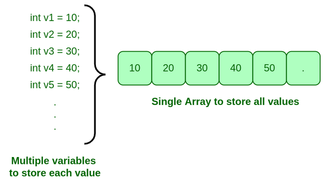
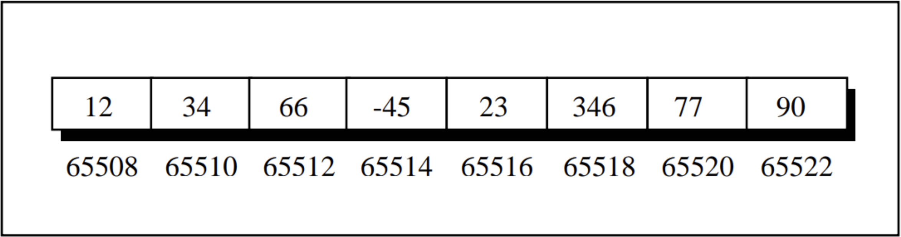
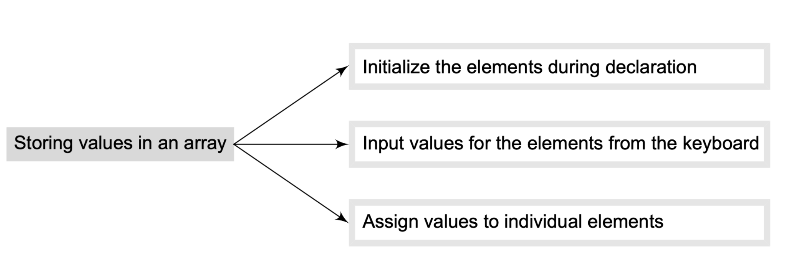

## INTRODUCTION
Let’s understand the concept of arrays using an analogy. Consider a situation in which we have 20 students in a class and we have been asked to write a program that reads and prints the marks of all the 20 students. In this program, we will need 20 integer variables with different names.
Now to read the values of these 20 variables, we must have 20 read statements. Similarly, to print the value of these variables, we need 20 write statements. If it is just a matter of 20 variables, then it might be acceptable for the user to follow this approach. But would it be possible to follow this approach if we have to read and print the marks of students,
in the entire course (say 100 students),
in the entire college (say 500 students),
in the entire university (say 10,000 students).
The answer is no, definitely not! To process a large amount of data, we need a data structure known as an array.



## ARRAY
Array can be defined as **a collection of similar data types that are stored at contiguous memory locations**.


### Array Declaration
Declaring an array means specifying the following:
- Data type - the kind of values it can store, for example, int, char, float, double.
- Name - to identify the array.
- Size - the maximum number of values that the array can hold.

Array can be declared using the following syntax:

`type name[size]`;
```cpp
int arr[8];
```

## Memory Representation of Array
Consider the following array declaration:
```cpp
int arr[8];
```
When we make this declaration, 32 bytes are immediately reserved in memory: 4 bytes for each of the 8 integers (which can vary depending on the operating system). Since the array is not being initialized, all eight values within it would be garbage values. This occurs because the storage class of this array is assumed to be 'auto'. However, if the storage class is declared as 'static', then all the array elements would have a default initial value of zero. Regardless of the initial values, all the array elements would always be located in contiguous memory locations.
This arrangement of array elements in memory is shown in the figure below.



## Storing Values in Array					
There are three ways to store values in an array, as mentioned in the figure below:
storing-values-in-arr



### 1. Initializing Arrays during Declaration:
The elements of an array can be initialized at the time of declaration, just as any other variable. When an array is initialized, we need to provide a value for every element in the array. Arrays are initialized by writing, `type array_name[size] = {list of values);`
```cpp
int arr[10] = {1, 2, 3, 4, 5, 6, 7, 8, 9, 0};
```

### 2. Input Values for the Elements from the Keyboard:
An array can be initialized by inputting values from the keyboard. In this method, a loop is executed to input the value for each element of the array. For example,
```cpp
int marks[10];
for(int i = 0; i < 10; i++){
    cin >> mark[i];
}
```

### 3. Assigning Values to Individual Elements:
The third way is to assign values to individual elements of the array by using the assignment operator. Any value that evaluates to the data type as that of the array can be assigned to the individual array element. A simple assignment statement can be written as,
```cpp
int arr[1] = 10;
int arr[2] = 20;
```
