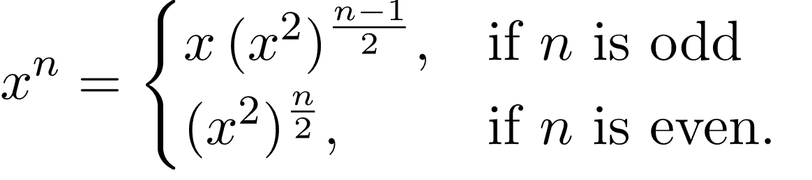
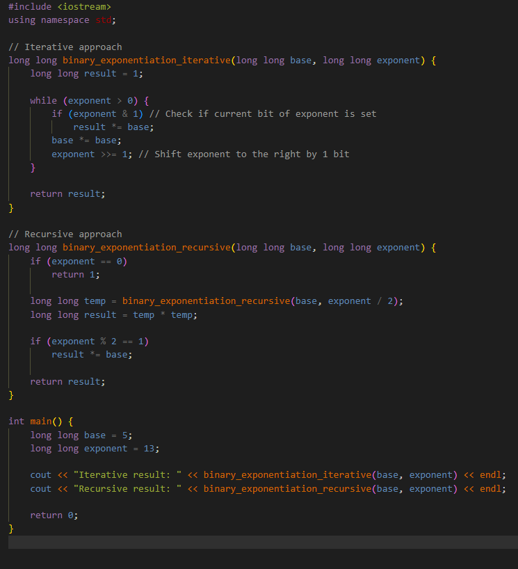
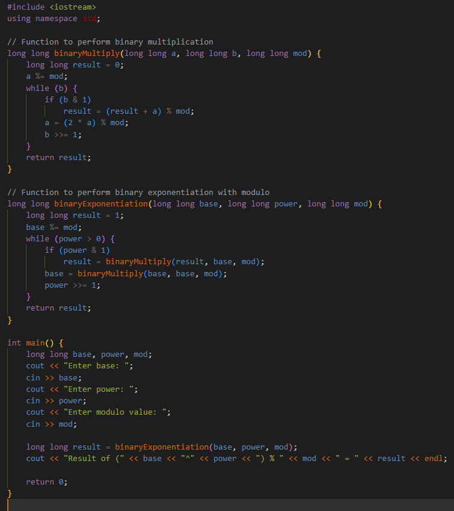

# EXPONENTIATION AND BINARY EXPONENTIATION

**<u>BINARY EXPONENTIATION</u>**
**Binary exponentiation**, also known as exponentiation by squaring, is a
Binary exponentiation, also known as exponentiation by squaring, is a
technique used to efficiently compute large powers of a number modulo
another number. It is particularly useful in computer science and
cryptography where large numbers are involved.

**<u>What is Binary Exponentiation?</u>**

***Binary Exponentiation **or **Exponentiation by squaring **is the
process of calculating a number raised to the power another number (AB)
in **Logarithmic **time of the exponent or power, which speeds up the
execution time of the program.*

NORMAL EXPONENTIATION:

36=3X3X3X3X3X3

36=9X3X3X3X3

36=27X3X3X3

36=81X3X3

36=243X3

36=729

Number of iterations to calculate 36 was 6 complexity O(n)
where n is the power of base 3.

BINARY EXPONENTIATION:

36 = (32)3

36=(9)3

36=(9)2X9

36=81X9

36=729

Number of iterations to calculate 36 was 3 complexity
O(log(n)) where n is the power of base 3.

**GENERAL FORMULA OF BINARY EXPONENTIATION**

C++ code for binary exponentiation both iterative and recursive

**Modulo arithmetic in binary exponentiation**

Lets say we have a number of order 1018 and modulo also
having value 1018+7 now for our binary exponentiation we have
to multiply two values of order 1018 which is the nearly
largest range of values in c++ so multiplying two values of order
1018 will give us a number of order 1036 which
cannot be stored by any data type in c++ giving an overflow
error(largest value storing data type has range nearly 1019
in c++) here the problem arises how are we going to mod it?

Long long a=(1018X1018)%mod gives overflow error
will return trash value

To deal with this problem we have yet another technique called binary
multiplication using the math here is.

If c=102

Then we can write c also like this

c = 10+10+10+10+10+10+10+10+10+10

now applying this same technique in above problem we have

a is of order 1018

if we need to multiply aXa

we can write it like this a+a+a+a+a……………………..+a

now (a+a)=2X1018 we can do the mod of this number without
getting any trash value and overflow errors.

(ab%mod)=(a%mod)b%mod

So if we do mod each time after calculating the sums of a it would not
have any effect on our final answer.

Since we have done binary multiplication + binary exponentiation the
time complexity of our code turns out to be O(log power X log a) hence
can be written simply as O((log(t))2).

**C++ code for applying binary multiplication in binary exponentiation
and to calculate mod**

**<u>Use Cases of Binary Exponentiation in Competitive
Programming:</u>**

1.  Matrix multiplication

2.  Fast calculation of n th Fibonacci number

3.  Compute a large number modulo

4.  Apply permutations of a given sequence large number of times

Practice problem set for binary exponentiation:

1.  <https://www.geeksforgeeks.org/problems/padovan-sequence2855/1>

2.  <https://leetcode.com/problems/fibonacci-number/description/>

(do it in log n complexity)

3.  <https://www.geeksforgeeks.org/problems/geometric-progression3042/1>

4.  <https://www.geeksforgeeks.org/problems/matrix-exponentiation2711/1>

5.  <https://www.geeksforgeeks.org/problems/leftmost-divisor3822/1>

6.  <https://leetcode.com/problems/powx-n/description/>

7.  <https://www.geeksforgeeks.org/problems/ncr-mod-m-part-10038/1>

8.  <https://www.geeksforgeeks.org/problems/generalised-fibonacci-numbers1820/1>
