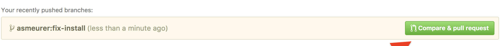

# CP-Handbook

## How to contribute
1. **Fork the repository** to you account(one can fork all branches), or click on fork icon


2. Clone your forked repository, or run this terminal command in your local folder where you want to clone:
```shell
git clone https://github.com/__YOUR_GITHUB_USER_NAME__/CP-Handbook
```

3. Head to cloned repository, or hit this command:
```shell
cd CP-Handbook
```

4. Create a separate branch heading to main branch, or run below commands:
```shell
git checkout main
git pull
git branch __YOU_BRANCH_NAME__
git checkout __YOU_BRANCH_NAME__
```

5. After making changes add and commit the changes in git:
```shell
git add .
git commit -m "__YOUR_COMMIT_MESSAGE__"
```

7. Push changes to github forked repository, but hitting:
```shell
git push origin -u __YOU_BRANCH_NAME__
```

8. Head over to forked repository on browser raise a Pull Request, find compare & pull request button to raise a pull request 



9. Give you PR an good name and a description and raise your Pull Request :)